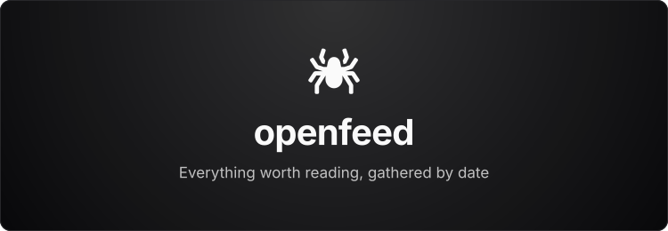

  

**openfeed** is a personalized reading feed — an archive of everything worth reading from the sources you keep, gathered and laid out one day at a time. Not a stream to keep up with, but a place your reading collects and stays.

> You know *what* to read, *where* to read, and *how much* to read. But the amount of content piling up — especially in this AI race — is a lot. So why not hand all the hard work to **openfeed** and **FeedX**?

## How it works

openfeed is only the reading surface. All the real work — finding, gathering, scoring, and distilling what's worth keeping — is done by [FeedX](https://github.com/ArnabChatterjee20k/FeedX), with a couple of frameworks I built recently to do it efficiently:

  <a href="https://github.com/ArnabChatterjee20k/FeedX">
    <picture>
      <source media="(prefers-color-scheme: dark)" srcset="./.github/assets/badge-feedx-dark.svg" />
      
    </picture>
  </a>
  <a href="https://github.com/ArnabChatterjee20k/Scout">
    <picture>
      <source media="(prefers-color-scheme: dark)" srcset="./.github/assets/badge-scout-dark.svg" />
      
    </picture>
  </a>
  <a href="https://github.com/ArnabChatterjee20k/domdistill">
    <picture>
      <source media="(prefers-color-scheme: dark)" srcset="./.github/assets/badge-domdistill-dark.svg" />
      
    </picture>
  </a>

- **[FeedX](https://github.com/ArnabChatterjee20k/FeedX)** — the core engine that gathers, scores, and produces the daily feed.
- **[Scout](https://github.com/ArnabChatterjee20k/Scout)** — a framework for collecting sources.
- **[domdistill](https://github.com/ArnabChatterjee20k/domdistill)** — a framework for distilling pages down to their readable substance.

The feed is **auto-populated**: this repo is the public template, while the actual daily reading lives in a separate **private fork** where FeedX writes a fresh day on a schedule. The public repo stays clean; the archive grows privately, one day at a time.
